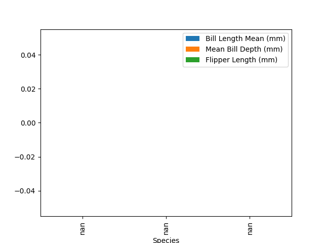
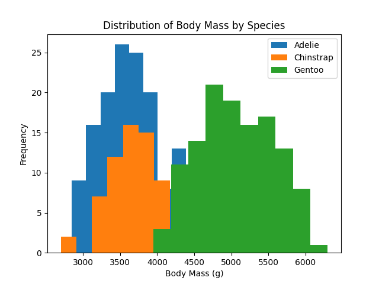
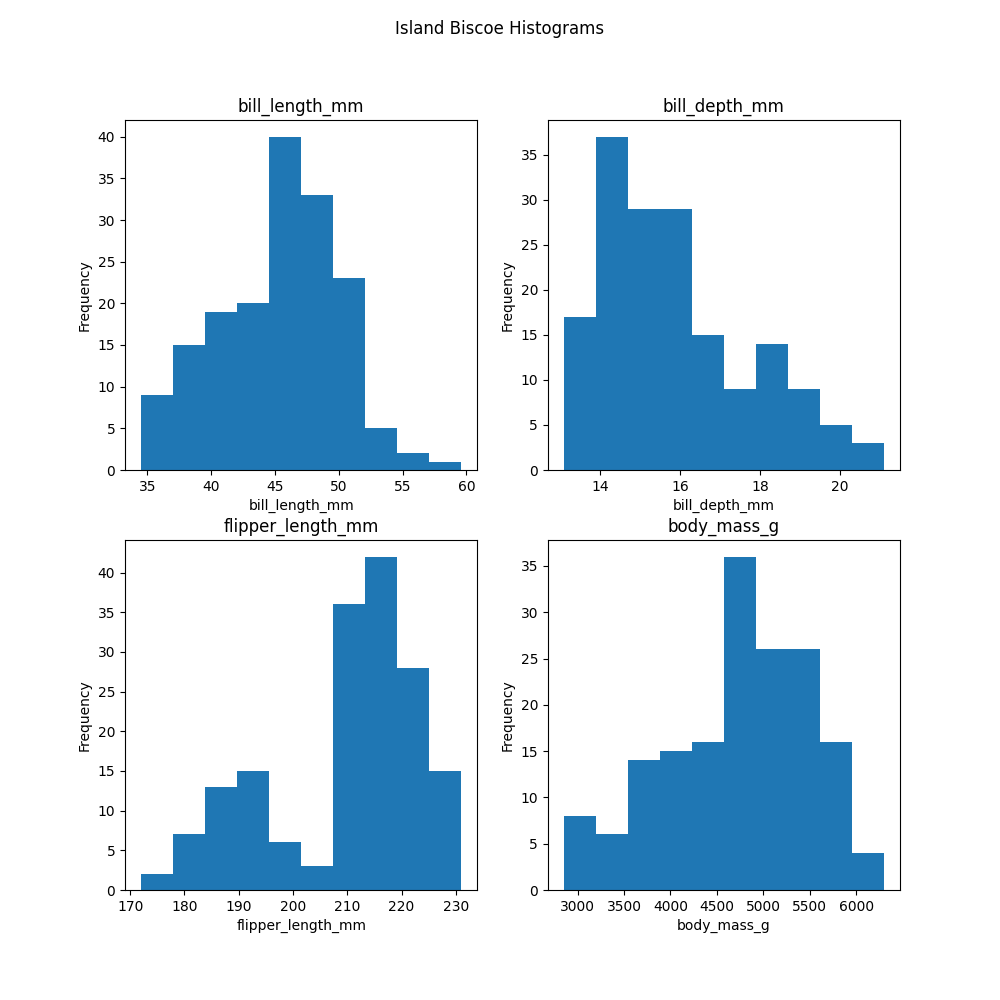
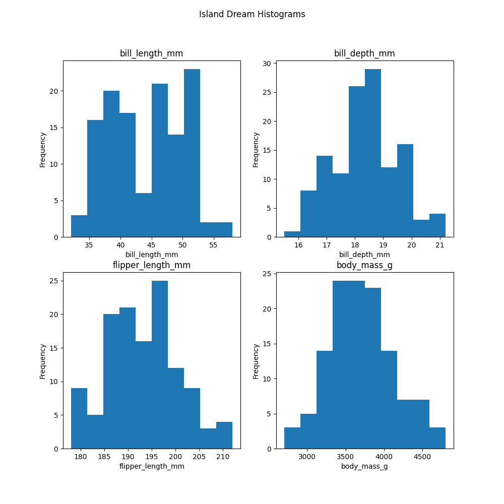
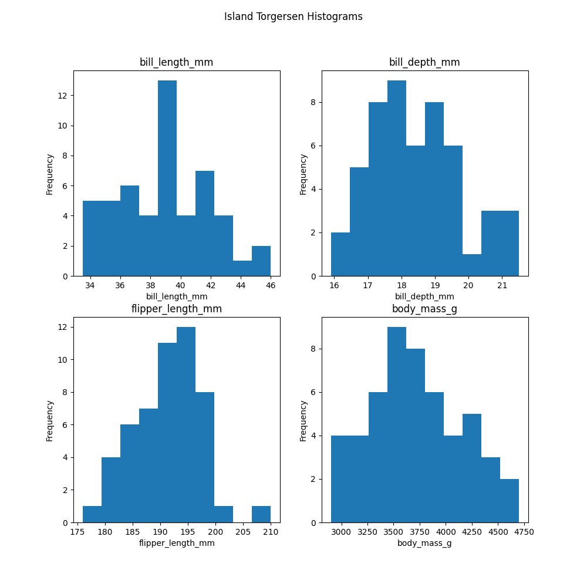
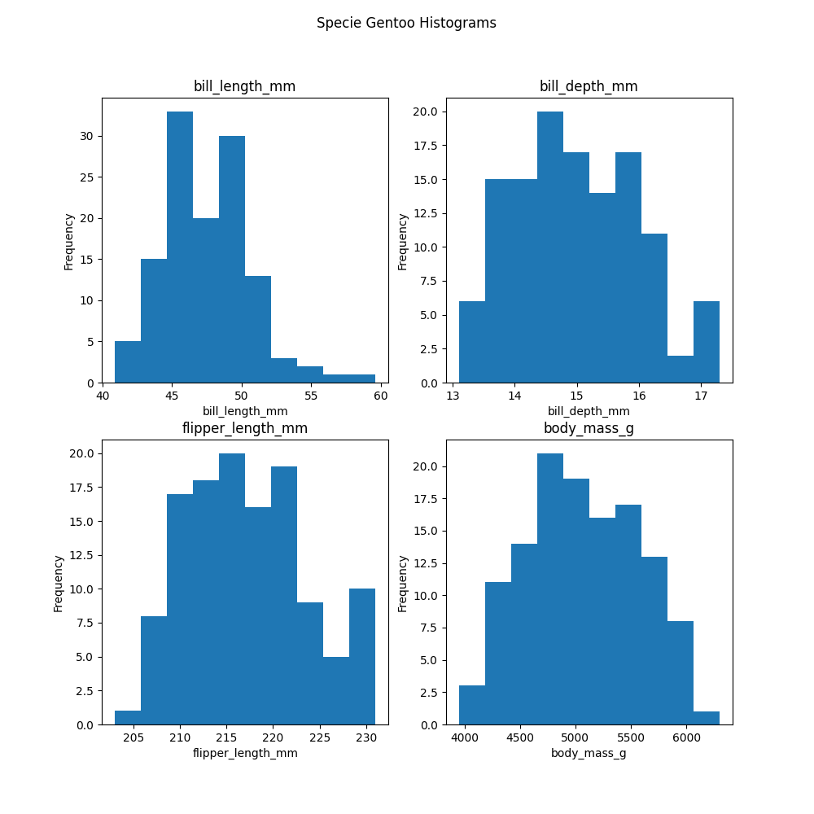

# Iris Dataset Project 2024

This repository contains an exploration of Palmer Penguins Dataset as part of the assessment in the  PRINCIPLES OF DATA ANALYTICS module for the Higher Diploma in Data Analytics with Galway-Mayo Institute of Technology.

## 1. Python Coding Methodology

This project challenged me to become familiar with several new libraries that have been widely used to investigate the Palmer Penguins Dataset. For the exploratory portion of the project, I learned the basics of using the *pandas* library to examine datasets as presented on item 7. References.

Rather than presenting the code generated for this project as a series of .py files, was suggested learn how to use *Jupyter Notebooks* for code presentation as output is presented in a much cleaner fashion and is altogether more legible.

## 2. The Dataset

The Palmer Penguins Dataset consists of 342 samples each of three different species of iris penguins: Adelie, Chinstrap and Genroo. It contains four different measurements for each sample bill length (mm), bill depth (mm) , flipper length (mm) , Island, Males and Females - making it a multivariate dataset.

The data was collected for research that was conducted as part of the Palmer Station, Antarctica, Long-Term Ecological Research program which was supported by grants through the National Science Foundation, Office of Polar Programs (NSF-OPP). Please see the funding statement in the canonical paper for further details.

## 3. Exploratory Data Analysis

*See Jupyter Notebook entitled **penguins.ipynb** for the code.*

This part of the project, I will be used *pandas* and *matplotlib* to read the dataset and perform statistical investigations.
 
*Pandas* allows us to see that the dataset is comprised of 344 rows and 7 columns; There are null values in the dataset that need to be accounted for in later analysis. We can also see that the dataset is well balanced with each species accounting for 344 samples.

### 4.1 Basic Statistics
The *describe* function in *pandas* shows some basic statistics such and means, histogran and medians per island and per species. 

 

### 4.2 Data Visualisation
It may be beneficial at this stage to visualise the data and the relationships between measurements to see if any patterns emerge. 

Straightaway we can see that iris setosa (blue) appears visually to be quite separate from the other two species in virtually all scatter plot feature combinations, but most drastically in petal measurements. While there is quite a bit of observable overlap between versicolor (orange) and virginica (green), particularly in terms of sepal measurements, setosa appears to be significantly linearly distinct. Petal length and width and sepal length in the setosa are significantly smaller than those of either versicolor or virginica, as we can see in the histograms where the setosa data is much closer to the left of each graph.    

Also, although versicolor and virginica are not cleanly distinct from one another, again the petal measurements demonstrate a pattern with virginica tending to have longer and wider petals than versicolor. Sepal measurements for these species are much more clustered when examined alone but when paired with petal measurements, distinctions can be seen as those with larger petals seemingly tend to also have larger sepals.

To see how each measurement is distributed by species, a box plot ([Brownlee, 2016](https://machinelearningmastery.com/machine-learning-in-python-step-by-step/)) or violin plot ([Mittapalli, 2018](https://medium.com/@harimittapalli/exploratory-data-analysis-iris-dataset-9920ea439a3e)) could be used but I prefer the similar but more legible swarm plot ([Kumar, 2018](https://www.kaggle.com/rakesh6184/seaborn-plot-to-visualize-iris-data)).

The swarm plots above demonstrate distribution differences between petal and sepal values. Petal measurements occupy a much smaller range per species than sepal measurements, which are more spread out. The larger distribution of sepal measurements means there are more outliers and thus more chances for the data to overlap between species, making classification based on sepal measurements more difficult. This, along with the density of petal data, provides further support to the hypothesis from the previous section that suggests the distinctions between species are likely petal-based rather than sepal-based. 

### 4.3 Correlations
It appears that a distinction exists between petal and sepal measurements so perhaps there is some internal consistency within them. The *pandas correlation* function tells us more about this:

Here we can see that:
* Petal length and width are very highly positively correlated (r = 0.96), which tells us that as one gets larger so does the other, indicating that petal length and width have a close relationship.
* On the other hand, sepal measurements have a very weak relationship with one another (r = -0.1).
* Both petal length and width have very strong positive correlations with sepal length (r = 0.87 and 0.82 respectively) indicating that as both get larger, so does sepal length.
* Both petal length and width have fairly weak negative correlations with sepal width (r = -0.42 and -0.36 respectively) indicating there is not much of a relationship between these features. 
* These correlations tell us that sepal width is not moderately or highly correlated with any other measurement.

The correlations can be visualised more easily on the below heatmap ([Kausar, 2018](https://www.kaggle.com/kamrankausar/iris-dataset-ml-and-deep-learning-from-scratch/notebook)). The large amount of red and orange squares show that the majority of measurements are highly correlated with one another, except for sepal width.

### 4.4 Univariate Analysis
Much of the previous analysis looked at the data overall so this section will take a closer look at each species individually (univaraite analysis) to see if we can further account for species distinction. For this, I split the Iris Dataset into three separate dataframes, one for each species ([Lynn, 2018](https://www.shanelynn.ie/select-pandas-dataframe-rows-and-columns-using-iloc-loc-and-ix/)).

#### 4.4.1 Overall Descriptors
First I look at the same overall descriptions as in section 4.1, but this time separated by species.

Observing each measurement by species again demonstrates significant differences between them:
* Setosa has the smallest average sepal length, petal length and petal width and yet the largest average sepal width.
* Minimum sepal width values appear fairly aligned across species but the setosa has the largest range at 2.1cm versus 1.4cm for versicolor and 1.6cm for virginica. However, taking a look back at the swarm plot in section 4.2 shows that the minimum sepal width value of setosa is an outlier and the minimum value is generally closer to 3cm. This may account for the previously observed weak correlations between sepal width and every other measurement (section 4.3) as setosa seems to buck the trend by being smallest in all measurements except for sepal width. 
* Interestingly, setosa petals are so much smaller than those of the other two species that its maximum petal measurements are still significantly smaller than the minimum petal measurements of either versicolor or virginica, suggesting a very large difference between setosa and the other two flower species in terms of petal size.
* Virginica is on average larger than versicolor in all measurements, indicating that it is generally a bigger flower.
* Looking at the minimum and maximum sepal measurements of versicolor and virginica shows they are quite closely aligned indicating considerable overlap in these values. Differences are more pronounced with petal measurements but there remains some amount of overlap which demonstrates that these species cannot be linearly separated. 
* Overall the differences between species again seems much more pronounced for petal measurements than sepal measurements. 

Looking a little more closely at the mean values of each species and comparing them to those observed for the entire dataset, shows that each species is distinct in these measurements when compared to overall averages and no one species could be deemed representative of the entire dataset. Standard deviations are also much smaller across all measurements for individual species than the overall standard deviations, suggesting that each species is more internally consistent than the dataset measurements as a whole.

#### 4.4.2 Visualising Univariate Data
While multivariate plots allow us to visualise the relationships between the attributes, univariate plots help us to understand each individual attribute ([Brownlee, 2016](https://machinelearningmastery.com/machine-learning-in-python-step-by-step/)). The histograms below show how the measurement data is represented across each species.

Again this demonstrates how the data within each species is distributed differently to the dataset as a whole. The data seems to skew more towards a normal distribution for sepal measurements than petal measurements across the board. This likely accounts for iris species being more easily separable by petal rather than sepal measurements. The non-normality of petal values, particularly in the 'ALL SPECIES' histogram, shows how drastically different setosa petal measurements are from the other two species. But this may also be related to the very small range of petal width values: in setosa there is only 0.5cm between the minimum and maximum measurements, 0.8cm for versicolor and 1.1cm for virginica. 

#### 4.4.3 Correlations
Unusually, while the overall correlations discussed in section 4.3 suggest much of the data is closely related, the same cannot be said when the measurements are split by species.

* While the overall dataset showed a massive positive correlation between petal length and width (r = 0.96), versicolor is the only species that maintains a high correlation (r = 0.79). Both setosa (r = 0.31) and virginica (r = 0.32) have much lower petal width to length correlations. 
* On the other hand, the very weak negative correlation observed between overall sepal length and width (r = -0.11), is improved and has become positive. Setosa has strong positive sepal correlations (r = 0.75), while versicolor (r = 0.53) and virginica (r = 0.46) have moderate positive correlations. It is possible that the weak correlation initially observed in sepal values is due to iris setosa, which is largest in average sepal width measurements while being smallest across all other features.
* In the initial correlations, petal length (r = 0.87) and width (r = 0.82) demonstrated strong positive correlations with sepal length. With the individual species, petal width and sepal length maintain weak positive correlations in setosa (r = 0.28) and virginica (r = 0.28) and a moderate positive correlation in versicolor (r = 0.55). Petal and sepal lengths are still highly correlated in versicolor (r = 0.75) and virginica (r = 0.86) but again a very weak correlation is observed with setosa (r = 0.26).

Some of these correlation discrepancies could be due to systematic differences between flowers, i.e. in the whole population as some features get bigger, the others tend to also grow but the same cannot be said for individual species ([Nicholls, 2014](https://www2.mrc-lmb.cam.ac.uk/download/lectures/lmb_statistics_course_2014/tutorial_answers/Tutorial_2_Descriptive_statistics_and_exploratory_data_analysis_answers.pdf)). However, these changes also demonstrate [Simpson's Paradox](https://en.wikipedia.org/wiki/Simpson%27s_paradox), which is a phenomenon in statistics whereby trends observed in the whole population can disappear or reverse when the population is broken down by category. Identification of this paradox and the reasons behind its occurrence can be quite complex ([Xu et al, 2018](https://aaai.org/ocs/index.php/FLAIRS/FLAIRS18/paper/download/17641/16887)).

## 5. Conclusion
The exploratory data analysis performed in this investigation uncovered many interesting details about the palmer penguins dataset but the main points of note are:
* Gentoo are distinguishable from both Adelie and Chinstrap. 
    * If measurements the body mass presented of an Gentoo are almost double in comparison to the other species.
    * Gentoo are predominatly found only on Biscoe island, witch also can be an evidence of more resource as the biggest species survived on that island.
* Chinstrap are only found on Dream island but there is no distinguition that let us understand that there is any natural  

The basic data studies presented above would then be expected to have little issue identifying setosa flowers but may encounter errors with versicolor and virginica differentiation, as seen in section 5.7. Prediction could be improved with more robust models but that is beyond the scope of the current investigation, which only aims to provide an overview of the Iris Dataset and how it can potentially be used as a machine learning model.   
 

## 6. References

https://vlegalwaymayo.atu.ie/course/view.php?id=8851

https://vlegalwaymayo.atu.ie/

https://ianmcloughlin.github.io/2324_principles_of_data_analytics/

[Co-pilot]

https://stackoverflow.com/questions/13445241/replacing-blank-values-white-space-with-nan-in-pandas
