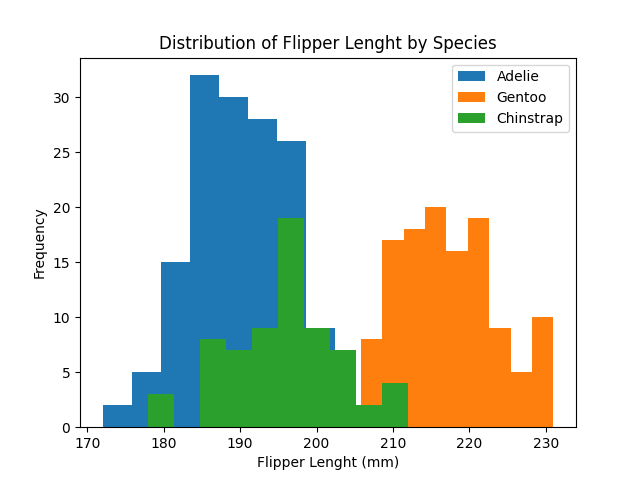
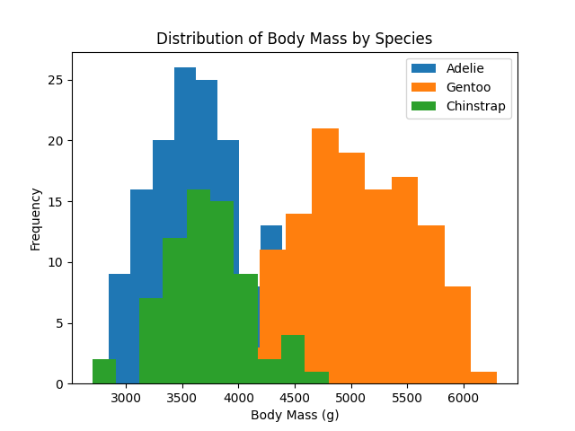

# Palmer Penguins Dataset Project 2024

This repository contains an exploration of Palmer Penguins Dataset as part of the assessment in the  PRINCIPLES OF DATA ANALYTICS module for the Higher Diploma in Data Analytics with Galway-Mayo Institute of Technology.

## 1. Python Coding Methodology

This project challenged me to become familiar with several new libraries that have been widely used to investigate the Palmer Penguins Dataset. For the exploratory portion of the project, I learned the basics of using the *pandas* library to examine datasets as presented on item 7. References.

Rather than presenting the code generated for this project as a series of .py files, was suggested learn how to use *Jupyter Notebooks* for code presentation as output is presented in a much cleaner fashion and is altogether more legible.

## 2. The Dataset

The Palmer Penguins Dataset consists of 342 samples each of three different species of iris penguins: Adelie, Chinstrap and Genroo. It contains four different measurements for each sample bill length (mm), bill depth (mm) , flipper length (mm) , Island, Males and Females - making it a multivariate dataset.

The data was collected for research that was conducted as part of the Palmer Station, Antarctica, Long-Term Ecological Research program which was supported by grants through the National Science Foundation, Office of Polar Programs (NSF-OPP). Please see the funding statement in the canonical paper for further details.

## 3. Exploratory Data Analysis

*See Jupyter Notebook entitled **penguins.ipynb** for the code.*

This part of the project, I will be used *pandas* and *matplotlib* to read the dataset and perform statistical investigations.
 
*Pandas* allows us to see that the dataset is comprised of 344 rows and 7 columns; There are null values in the dataset that need to be accounted for in later analysis. We can also see that the dataset is well balanced with each species accounting for 344 samples.

### 4.1 Basic Statistics
The *describe* function in *pandas* shows some basic statistics such and means, histogran and medians per island and per species. 

#### By Island:

#### By Species:

 

## 5. Conclusion

The exploratory data analysis performed in this investigation uncovered many interesting details about the palmer penguins dataset but the main points of note are:
* Gentoo are distinguishable from both Adelie and Chinstrap. 
    * If measurements the body mass presented of an Gentoo are almost double in comparison to the other species.
    * Gentoo are predominatly found only on Biscoe island, witch also can be an evidence of more resource as the biggest species survived on that island.
* Chinstrap are only found on Dream island but there is no distinguition that let us understand that there is any natural  

The basic data studies presented above would then be expected to have little issue identifying setosa flowers but may encounter errors with versicolor and virginica differentiation, as seen in section 5.7. Prediction could be improved with more robust models but that is beyond the scope of the current investigation, which only aims to provide an overview of the Iris Dataset and how it can potentially be used as a machine learning model.   
 

## 6. References

https://vlegalwaymayo.atu.ie/course/view.php?id=8851

https://vlegalwaymayo.atu.ie/

https://ianmcloughlin.github.io/2324_principles_of_data_analytics/

[Co-pilot]

https://stackoverflow.com/questions/13445241/replacing-blank-values-white-space-with-nan-in-pandas
